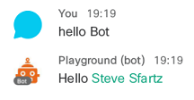
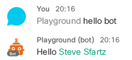
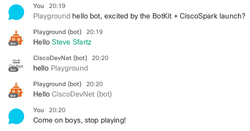
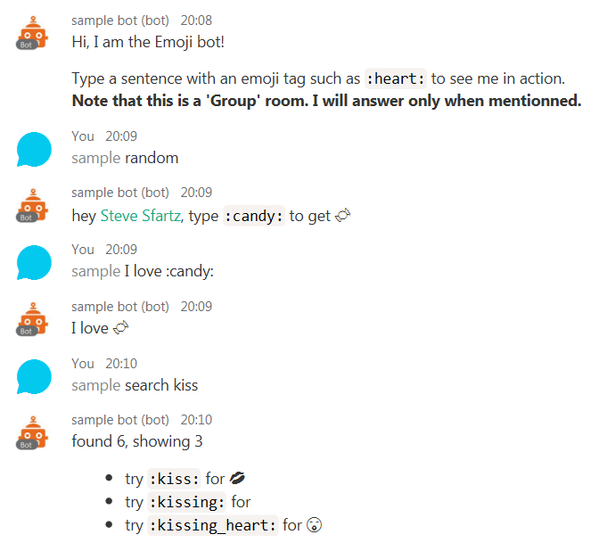

# Botkit samples for Webex Teams

This community project driven regroups:
- Webex Teams bot samples built with [Howdy's Botkit](https://github.com/howdyai/botkit)
- a template to quickly bootstrap your Bot project
- an experimental websocket usage example

We suggest you start with the HelloWorld bot sample below.

**New to Botkit?**
- read the ["Botkit guide"](https://github.com/howdyai/botkit/blob/master/docs/readme-ciscospark.md)
- take the ["Create Conversational Bots with Botkit" learning lab](https://learninglabs.cisco.com/tracks/collab-cloud/spark-apps/collab-spark-botkit/step/1)

**New to Webex Teams?**
- go straight to [Webex for Developers](https://developer.webex.com), signin and click [My apps](https://developer.webex.com/apps.html) to create a Webex Teams bot account.


## Hello World (bot command)

Simplest bot [you can code](helloworld.js#L62): echo a message with a mention of the Webex Teams user who mentionned the bot.



And don't forget to mention him in group rooms.



Note that the bot will respond to anyone mentioning him,
then no reason why he could not chat with other bots.
Below, the Hello bot (impersonnated via the Playground bot token) helling the CiscoDevNet bot.



Assuming your bot is accessible from the internet or you exposed it via a tunneling tool such as [ngrok](https://ngrok.com), you can run any sample in a snatch:


### How to run 

From a Mac/Linux bash shell, type:

```shell
> git clone https://github.com/CiscoDevNet/botkit-webex-samples
> cd botkit-webex-samples
> npm install
> ACCESS_TOKEN=0123456789abcdef PUBLIC_URL=https://abcdef.ngrok.io SECRET="not that secret" node helloworld.js
```

From a Windows CMD shell, type:

```shell
> git clone https://github.com/CiscoDevNet/botkit-webex-samples
> cd botkit-webex-samples
> npm install
> set ACCESS_TOKEN=0123456789abcdef
> set PUBLIC_URL=https://abcdef.ngrok.io
> set SECRET=not that secret
> node helloworld.js
```

where:

- ACCESS_TOKEN is the API access token of your Webex Teams bot
- PUBLIC_URL is the root URL at which the Webex Cloud platform can reach your bot
- SECRET is the secret that Webex uses to sign the JSON webhooks events posted to your bot
- [ngrok](http://ngrok.com) helps you expose the bot running on your laptop to the internet, type: `ngrok http 8080` to launch


## Bootstrap a Botkit project for Webex Teams (template)

The [template](template/) regroups a set of best practices:
- configuration: pass settings either through environment variables on the command line, or by hardcoding some of them in the `.env` file. Note that env variable are priorized over the `env`file if values are found in both places.
- healthcheck: check if everything is going well by hitting the `ping` endpoint exposed automatically. 
- skills: organize your bot behaviours by placing 'hear commands', 'convos' and 'events' in the [skills directory](template/skills/). The bot comes with a ".commons", "help", "fallback" and "welcome" skills.


## Conversations demo bot (convos)

A [conversational bot](convos/) that illustrates Botkit conversation system through examples. The bot is built with the [template provided in this repo](template/).

You can test the bot live by inviting `convos@sparkbot.io` to a Webex Teams's space.


## DevNet events (external api invocation)

This bot illustrates how you can [create conversations](externalapi/bot.js#L117),
and uses a [wrapper to an external API](externalapi/events.js) hosted on Heroku that lists current and upcoming events at DevNet.


## Emoji (websocket)

This [bot turns emoji tags](emoji.js#58) to unicode characters and posts back the 'emojified' phrase

The bot leverages the [experimental websocket library for Webex Teams](https://github.com/marchfederico/ciscospark-websocket-events),
so that you don't need to register a Webhook and expose your bot on the internet.

From a Mac/Linux bash shell, type:

```shell
> npm install
> ACCESS_TOKEN=0123456789abcdef node emoji.js
```

From a Windows shell, type:

```shell
> npm install
> set ACCESS_TOKEN=0123456789abcdef
> node emoji.js
```

