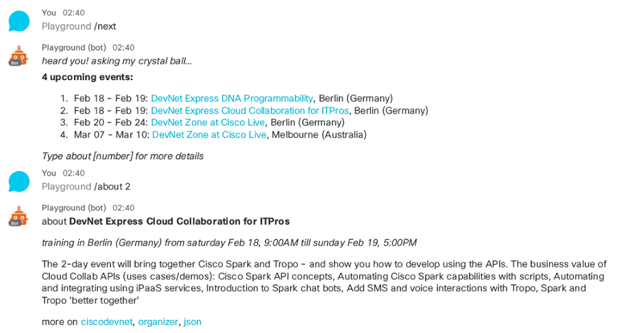

# Example of a conversation with a menu built dynamically from an external API 

This bot illustrates how you can [create conversations](externalapi/bot.js#L117),
and uses a [wrapper to an external API](externalapi/events.js) hosted on Heroku that lists current and upcoming events at DevNet.

